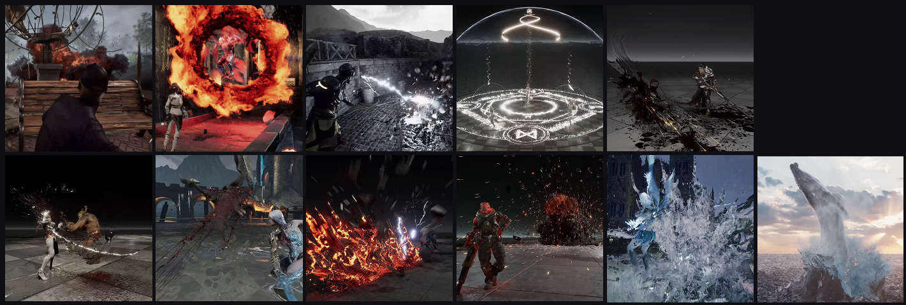
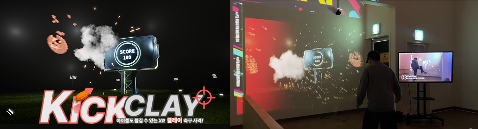

# 💨 Technical Artist | Bridging Art and Technology

C++ 엔진 아키텍처와 그래픽스 파이프라인에 대한 이해를 바탕으로, 상호작용과 그래픽 표현의 한계를 확장하는 Technical Artist입니다

Unreal Engine C++, Technical VFX, Pipeline 기술을 융합하여 아티스트의 표현력을 극대화하고 게임의 퍼포먼스를 확보하는 데 집중합니다.

## 🛠 Tech Stack
### Core
    

### Technical Art
- Houdini VEX & Digital Asset (HDA)
- UE Niagara / CasCade, Material & Shader
- Pipeline Automation

### Graphics & Optimization
- Rendering Pipeline
- CPU/GPU Profiling
- Performance Optimization
- Realtime Rendering

### 🚩 Main Project Portfolio

| MainProject                                                                                                                                                                                                                                                                                                                                                                                                                                                                                                                                                                                                                                                                                                                                                                                                                                                                               |
| :---------------------------------------------------------------------------------------------------------------------------------------------------------------------------------------------------------------------------------------------------------------------------------------------------------------------------------------------------------------------------------------------------------------------------------------------------------------------------------------------------------------------------------------------------------------------------------------------------------------------------------------------------------------------------------------------------------------------------------------------------------------------------------------------------------------------------------------------------------------------------------------- |
|    ** 💾[DirectX 11 기술 데모 ](https://github.com/piusAI/DirectX11_ThorPrj)**  <small style="color: #666;">📅 2026.06</small>        · 렌더링 파이프라인의 본질적 이해를 위해 밑바닥부터 직접 구현한 로우레벨 그래픽스 프레임워크  · 커스텀 그래픽스 파이프라인 설계 및 자체 HLSL 셰이더 빌드 역량 증명                                                                                                |
|    **🎮 [Beat & Beasties (Steam 데모 출시)](https://store.steampowered.com/app/4267610/Beat__Beasties/)**  <small style="color: #666;">📅 2025.09 ~ 2026.03</small>     · **메인 아트 총괄 및 플레이어블 핵심 개발 참여**   · 레벨 디자이너용 HDA 파이프라인 구축을 통해 **프로젝트 반복 테스트 비용 대폭 절감**                                                             |
| **🎮 [Q-Pop Girl (Steam 정식 출시)](https://store.steampowered.com/app/4157070/QPopGirl/)**   <small style="color: #666;">📅 2025.12 ~ 2026.05</small>    · **글로벌 스팀 플랫폼 론칭 빌드 및 퍼블리싱 과정 주도**  · 아트 참여 및, 콘텐츠 폴리싱                                                                                                                                                                                                                               |
|   **🎨 [VFX Portfolio](https://www.artstation.com/piusai)**  <small style="color: #666;">📅 2024.04 ~ 2025.03</small>     · AAA 게임 타겟 실시간 이펙트 퀄리티 구현  · VAT, Animation keyframe 동적 생성 Mesh 등 절차적 VFX 파이프라인 구축                                                                                                                                                                                                 |
|   **🎮 [XR KickClay](https://www.youtube.com/watch?v=fMi-oCwVEYk)**   <small style="color: #666;">📅 2025.06 ~ 2025.10</small>      · [언리얼 엔진5 기반 하이브리드 프로젝션 XR 환경 성능 최적화](https://github.com/piusAI/piusAI/blob/main/Performance%20Optimization%20of%20a%20Hybrid%20XR%20Environment%20Based%20on%20Unreal%20Engine%205.pdf)  · 🏆 2025년 한국 게임 학회 추계 학술대회 논문 우수상 수상작  · 대형 하이브리드 프로젝션 XR 환경에서의 실시간 센서 연동 시스템 구축 |

### 🛠️ Other Technical R&D & Prototypes (기타 연구 및 프로토타입)

| 프로젝트 제목                                                                                                    | 핵심 기술                                               |     개발 기간     |
| :--------------------------------------------------------------------------------------------------------- | :-------------------------------------------------- | :-----------: |
| [📺 Unity-HDA](https://youtu.be/5EGHmrIraA0)                                                               | 우주 배경의 맵 생성을 위해 Houdini HDA 구조를 활용한 Unity HDA 프로토타입 |     25.06     |
| [📺 Houdini Procedural Modeling](https://www.youtube.com/playlist?list=PLcBkRBTJf8ZI9YiDyFrWVfVmLf8Bs3cWU) | Houdini VEX 기반 절차적 모델링 및 HDA 파이프라인 구축               | 23.10 ~ 24.04 |
| [📺 RAG + QDrant + Streamlit](https://youtube.com/shorts/fpU0kqvtkbo)                                      | RAG 기반 축구인 재활 프로토타입                                 | 25.11 ~ 25.12 |
| [📺 실시간 자세 추정 및 점수 시각화](https://youtu.be/2spXeHQ4doA)                                                      | 실시간 자세 추정/분석 프로토타입                                  | 25.07 ~ 25.10 |

## 🚀 Technical R&D (기술 연구 및 진행 중인 프로젝트)
### K-Zombie FPS UE 게임 개발 (26.06 ~ 진행 중)
- Gameplay Ability System(GAS) 및 동적 애니메이션 시스템 기반의 FPS 전투 아키텍처 구축
### DirectX 11 / HLSL / UE Plugin
- 로우레벨 그래픽스 렌더링 파이프라인 및 커스텀 HLSL 셰이더 연구
- 언리얼 엔진 아티스트 파이프라인 효율화를 위한 **Editor Tool 및 Plugin 구조** R&D

## 🎓 Education & Awards
- 2025 한국 게임학회 추계 학술대회 논문 우수상(25.10) : [언리얼 엔진5 기반 하이브리드 프로젝션 XR 환경 성능 최적화](https://github.com/piusAI/piusAI/blob/main/Performance%20Optimization%20of%20a%20Hybrid%20XR%20Environment%20Based%20on%20Unreal%20Engine%205.pdf)
- **홍익대학교 게임학부 석사 과정** : 25.09 ~ 27.08

## 📧 Contact
- **Email :** hwangpiusjoon@gmail.com
- **Blog :** https://piusai.github.io/
- **ArtStation :** https://www.artstation.com/piusai
- **Youtube :** https://www.youtube.com/@h0wju

